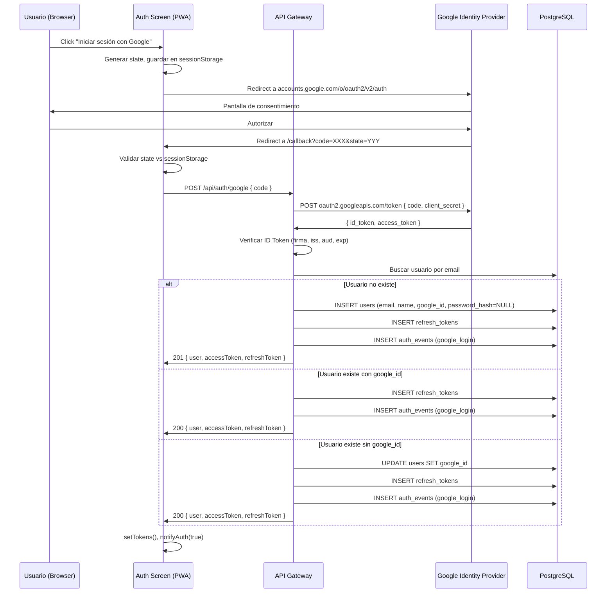

# Documento de Diseño — Google OAuth Login

## Visión General

Esta funcionalidad integra Google OAuth 2.0 / OpenID Connect como método alternativo de autenticación en KeepWeChat. El flujo sigue el patrón estándar de Authorization Code: el frontend redirige al usuario a Google, recibe un `code` en el callback, lo envía al backend, y el backend lo intercambia por un ID Token de forma server-side. El sistema reutiliza completamente la infraestructura JWT existente (access + refresh tokens) para que la sesión OAuth sea indistinguible de una sesión por email/contraseña.

### Decisiones de diseño clave

1. **`google-auth-library` en lugar de `googleapis`**: Se usará el paquete `google-auth-library` en el API Gateway porque es más liviano y específico para verificación de tokens OAuth. El paquete `googleapis` ya existe en `calendar-service` pero incluye APIs innecesarias para este caso.

2. **Flujo server-side completo**: El intercambio del authorization code y la verificación del ID Token se realizan exclusivamente en el backend. El frontend solo maneja la redirección y el envío del code.

3. **Vinculación automática de cuentas**: Si un usuario ya tiene cuenta por email/contraseña y se autentica con Google usando el mismo email, la cuenta se vincula automáticamente asignando el `google_id`.

4. **Migración incremental**: Se agrega una migración `013` que añade `google_id` a `users`, hace `password_hash` nullable, y extiende el CHECK constraint de `auth_events`.

## Arquitectura



### Componentes afectados

| Componente | Archivo | Cambio |
|---|---|---|
| Auth Screen | `src/ui/auth-screen.ts` | Botón Google, redirección OAuth, manejo de callback |
| API Client | `src/ui/api-client.ts` | Nueva función `apiGoogleLogin(code)` |
| Auth Routes | `services/api-gateway/src/routes/auth.ts` | Nuevo endpoint `POST /google` |
| JWT Middleware | `services/api-gateway/src/middleware/jwt-auth.ts` | Agregar `/api/auth/google` a `PUBLIC_PATHS` |
| Migración | `services/api-gateway/migrations/013_add_google_oauth.sql` | Columna `google_id`, `password_hash` nullable, constraint `auth_events` |

## Componentes e Interfaces

### 1. Endpoint `POST /api/auth/google`

Nuevo handler en `services/api-gateway/src/routes/auth.ts`.

```typescript
// Request body
interface GoogleAuthRequest {
  code: string;  // Authorization code de Google
}

// Response body (misma estructura que login/register)
interface AuthResponse {
  user: { id: string; email: string; name: string; role: string };
  accessToken: string;
  refreshToken: string;
}
```

**Flujo interno:**
1. Recibir `code` del body
2. Intercambiar `code` por tokens usando `google-auth-library` (`OAuth2Client.getToken()`)
3. Verificar el `id_token` con `OAuth2Client.verifyIdToken()` — valida firma, issuer (`accounts.google.com`), audience (`GOOGLE_CLIENT_ID`), expiración
4. Extraer claims: `sub` (google_id), `email`, `name`
5. Buscar usuario por email en DB
6. Crear o vincular según corresponda
7. Generar access + refresh tokens con las funciones existentes
8. Registrar evento de auditoría
9. Responder con `AuthResponse`

### 2. Función `apiGoogleLogin` en API Client

```typescript
// src/ui/api-client.ts
export async function apiGoogleLogin(code: string): Promise<AuthResponse> {
  const data = await apiFetch<AuthResponse>('/api/auth/google', {
    method: 'POST',
    body: JSON.stringify({ code }),
  });
  setTokens(data.accessToken, data.refreshToken);
  notifyAuth(true);
  return data;
}
```

### 3. Flujo OAuth en Auth Screen

El `auth-screen.ts` se extiende con:

- **Botón "Iniciar sesión con Google"**: Visible en ambos modos (login/register)
- **Función `startGoogleOAuth()`**: Genera `state` aleatorio, lo guarda en `sessionStorage`, construye la URL de autorización y redirige
- **Detección de callback**: Al cargar, si `window.location.search` contiene `code` y `state`, valida el `state` contra `sessionStorage` y llama a `apiGoogleLogin(code)`
- **Redirect URI**: `${window.location.origin}/` (la raíz de la PWA)

### 4. Google OAuth2Client (Backend)

```typescript
import { OAuth2Client } from 'google-auth-library';

const oauthClient = new OAuth2Client(
  process.env.GOOGLE_CLIENT_ID,
  process.env.GOOGLE_CLIENT_SECRET,
  process.env.GOOGLE_OAUTH_REDIRECT_URI  // e.g. http://localhost:3000/
);
```

Se necesita agregar `GOOGLE_OAUTH_REDIRECT_URI` al `.env` (distinto del `GOOGLE_REDIRECT_URI` del calendar service).

## Modelos de Datos

### Migración 013: `013_add_google_oauth.sql`

```sql
-- Migration 013: Add Google OAuth support
-- Requisitos: 5.1, 5.2, 5.3

-- 5.1: Agregar columna google_id a users
ALTER TABLE users ADD COLUMN google_id VARCHAR(255) UNIQUE;

-- 5.2: Hacer password_hash nullable para usuarios OAuth-only
ALTER TABLE users ALTER COLUMN password_hash DROP NOT NULL;

-- 5.3: Agregar google_login al constraint de auth_events
ALTER TABLE auth_events DROP CONSTRAINT chk_auth_events_event_type;
ALTER TABLE auth_events ADD CONSTRAINT chk_auth_events_event_type
    CHECK (event_type IN ('login_success', 'login_failed', 'token_refresh', 'logout', 'google_login'));
```

### Tabla `users` (después de migración)

| Columna | Tipo | Nullable | Notas |
|---|---|---|---|
| id | UUID | NO | PK, gen_random_uuid() |
| email | VARCHAR(255) | NO | UNIQUE |
| name | VARCHAR(255) | NO | |
| password_hash | VARCHAR(255) | **SÍ** | NULL para usuarios OAuth-only |
| google_id | VARCHAR(255) | SÍ | UNIQUE, claim `sub` de Google |
| role | VARCHAR(20) | NO | 'admin' \| 'user' |
| is_active | BOOLEAN | NO | default true |
| created_at | TIMESTAMPTZ | NO | |
| updated_at | TIMESTAMPTZ | NO | |

### Tabla `auth_events` (constraint actualizado)

Valores permitidos en `event_type`: `login_success`, `login_failed`, `token_refresh`, `logout`, `google_login`.


## Propiedades de Corrección

*Una propiedad es una característica o comportamiento que debe cumplirse en todas las ejecuciones válidas de un sistema — esencialmente, una declaración formal sobre lo que el sistema debe hacer. Las propiedades sirven como puente entre especificaciones legibles por humanos y garantías de corrección verificables por máquinas.*

### Propiedad 1: Construcción correcta de la URL de autorización OAuth

*Para cualquier* `client_id` y `redirect_uri` válidos, la URL de autorización construida debe contener los parámetros `client_id`, `redirect_uri`, `response_type=code`, `scope=openid email profile`, y un parámetro `state` no vacío.

**Valida: Requisitos 1.2**

### Propiedad 2: Persistencia y validación del parámetro state

*Para cualquier* par de valores `(state_recibido, state_almacenado)`, el código de autorización se envía al backend si y solo si `state_recibido === state_almacenado` y ambos son no vacíos. Si no coinciden o alguno está ausente, el flujo se cancela.

**Valida: Requisitos 1.3, 7.1, 7.2**

### Propiedad 3: Validación de claims del ID Token

*Para cualquier* ID Token con combinaciones de claims (issuer, audience, expiración), el OAuth_Handler solo debe aceptar tokens donde el issuer sea `accounts.google.com` o `https://accounts.google.com`, el audience coincida con `GOOGLE_CLIENT_ID`, y la expiración no haya pasado. Tokens con claims inválidos deben ser rechazados.

**Valida: Requisitos 2.3**

### Propiedad 4: Código inválido o token inválido retorna 401

*Para cualquier* authorization code inválido o ID Token que falle la verificación, el endpoint `POST /api/auth/google` debe responder con código HTTP 401 y un mensaje de error descriptivo.

**Valida: Requisitos 2.4**

### Propiedad 5: Creación correcta de usuario OAuth nuevo

*Para cualquier* perfil de Google válido (email, name, sub) donde no exista un usuario con ese email en la base de datos, el sistema debe crear un registro en `users` con: el email del token, el nombre del perfil, `google_id` igual al claim `sub`, `password_hash` nulo, `role = 'user'`, e `is_active = true`.

**Valida: Requisitos 3.1, 3.2**

### Propiedad 6: Consistencia de formato de tokens con flujo email/contraseña

*Para cualquier* usuario autenticado mediante Google OAuth, los tokens emitidos (access token de 15 minutos, refresh token de 7 días) deben tener la misma estructura de payload JWT (`userId`, `role`) y los mismos tiempos de expiración que los generados por el flujo de email/contraseña.

**Valida: Requisitos 3.3, 8.1**

### Propiedad 7: Login de usuario existente con google_id

*Para cualquier* usuario existente que ya tiene un `google_id` asociado, una autenticación OAuth con el mismo email debe emitir tokens JWT válidos para ese usuario sin modificar el registro.

**Valida: Requisitos 4.1**

### Propiedad 8: Vinculación automática de cuenta existente sin google_id

*Para cualquier* usuario existente creado por email/contraseña (sin `google_id`), una autenticación OAuth con el mismo email debe asignar el `google_id` del claim `sub` al registro existente y emitir tokens JWT.

**Valida: Requisitos 4.2**

### Propiedad 9: Rechazo de cuenta desactivada

*Para cualquier* usuario con `is_active = false` que intente autenticarse mediante Google OAuth, el sistema debe responder con código HTTP 401 y el mensaje "La cuenta está desactivada".

**Valida: Requisitos 4.3**

### Propiedad 10: Auditoría de login exitoso

*Para cualquier* autenticación exitosa mediante Google OAuth, el sistema debe registrar un evento de tipo `google_login` en la tabla `auth_events` con el `user_id` correcto y la dirección IP del cliente.

**Valida: Requisitos 6.1**

### Propiedad 11: Auditoría de login fallido

*Para cualquier* intento fallido de autenticación OAuth (código inválido, token inválido, cuenta desactivada), el sistema debe registrar un evento de tipo `login_failed` en la tabla `auth_events` con la dirección IP del cliente.

**Valida: Requisitos 6.2**

### Propiedad 12: Compatibilidad de tokens OAuth con refresh y logout

*Para cualquier* usuario autenticado mediante Google OAuth, los tokens emitidos deben funcionar correctamente con los endpoints existentes `POST /api/auth/refresh` (rotación de tokens) y `POST /api/auth/logout` (invalidación de refresh token).

**Valida: Requisitos 8.2, 8.3**

### Propiedad 13: Estructura de respuesta consistente con login tradicional

*Para cualquier* autenticación exitosa mediante Google OAuth, la respuesta JSON debe contener los campos `user` (con `id`, `email`, `name`, `role`), `accessToken` y `refreshToken`, con la misma estructura que `POST /api/auth/login`.

**Valida: Requisitos 9.1**

### Propiedad 14: Código HTTP correcto según tipo de operación

*Para cualquier* autenticación exitosa mediante Google OAuth, el código HTTP de respuesta debe ser 201 cuando se crea un nuevo usuario y 200 cuando se autentica un usuario existente.

**Valida: Requisitos 9.2, 9.3**

## Manejo de Errores

| Escenario | Código HTTP | Mensaje | Acción adicional |
|---|---|---|---|
| `code` ausente en el body | 400 | `"code is required"` | — |
| Intercambio de code falla con Google | 401 | `"Google authentication failed"` | Registrar `login_failed` en `auth_events` |
| ID Token inválido (firma, claims) | 401 | `"Invalid Google token"` | Registrar `login_failed` en `auth_events` |
| Cuenta desactivada (`is_active = false`) | 401 | `"La cuenta está desactivada"` | Registrar `login_failed` en `auth_events` |
| Error interno de base de datos | 500 | `"Internal server error"` | Log con `logger.error` |
| State mismatch en frontend | — | Mostrar error en UI | No enviar code al backend |
| Google no disponible (timeout) | 502 | `"Google authentication service unavailable"` | Registrar `login_failed` en `auth_events` |

## Estrategia de Testing

### Enfoque dual: Tests unitarios + Tests basados en propiedades

Se utilizan ambos enfoques de forma complementaria:

- **Tests unitarios**: Casos específicos, edge cases, integración con mocks de Google
- **Tests basados en propiedades**: Propiedades universales que deben cumplirse para todas las entradas válidas

### Librería de Property-Based Testing

Se usará **fast-check** (`fc`) para TypeScript, que ya es compatible con el stack de testing existente (Vitest).

### Configuración de tests de propiedades

- Mínimo **100 iteraciones** por test de propiedad
- Cada test debe referenciar la propiedad del diseño con un comentario:
  ```
  // Feature: google-oauth-login, Property {N}: {título}
  ```

### Tests unitarios planificados

1. **Endpoint POST /api/auth/google** (con mocks de `google-auth-library`):
   - Caso exitoso: nuevo usuario → 201
   - Caso exitoso: usuario existente con google_id → 200
   - Caso exitoso: vinculación de cuenta → 200 + google_id actualizado
   - Error: code ausente → 400
   - Error: code inválido → 401
   - Error: cuenta desactivada → 401

2. **Frontend OAuth flow**:
   - Botón visible en ambos modos
   - URL de autorización correcta
   - Callback con state válido → llama apiGoogleLogin
   - Callback con state inválido → muestra error

3. **Migración**:
   - Columna google_id existe y es UNIQUE nullable
   - password_hash es nullable
   - auth_events acepta 'google_login'

### Tests de propiedades planificados

Cada propiedad de corrección (1–14) se implementará como un test de propiedad individual usando fast-check:

- **Propiedad 1**: Generar client_ids y redirect_uris aleatorios → verificar URL
- **Propiedad 2**: Generar pares de state aleatorios → verificar lógica de coincidencia
- **Propiedad 3**: Generar tokens con claims aleatorios → verificar aceptación/rechazo
- **Propiedad 4**: Generar escenarios de fallo → verificar 401
- **Propiedad 5**: Generar perfiles Google aleatorios → verificar creación correcta
- **Propiedad 6**: Generar usuarios OAuth → verificar formato de tokens
- **Propiedad 7**: Generar usuarios existentes con google_id → verificar login
- **Propiedad 8**: Generar usuarios sin google_id → verificar vinculación
- **Propiedad 9**: Generar usuarios desactivados → verificar rechazo
- **Propiedad 10**: Generar logins exitosos → verificar evento audit
- **Propiedad 11**: Generar logins fallidos → verificar evento audit
- **Propiedad 12**: Generar tokens OAuth → verificar compatibilidad refresh/logout
- **Propiedad 13**: Generar respuestas OAuth → verificar estructura
- **Propiedad 14**: Generar escenarios nuevo/existente → verificar código HTTP
