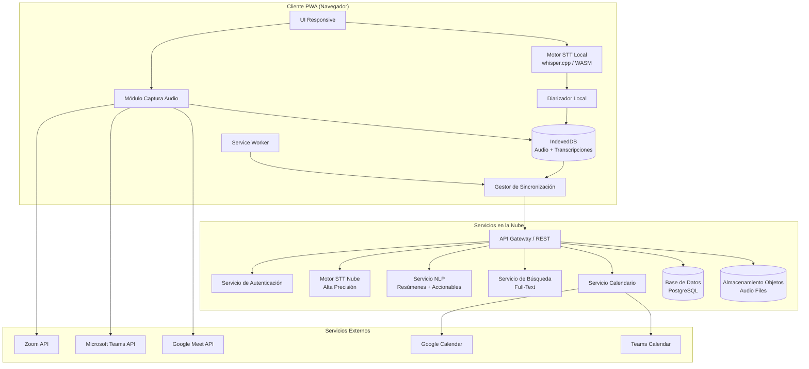
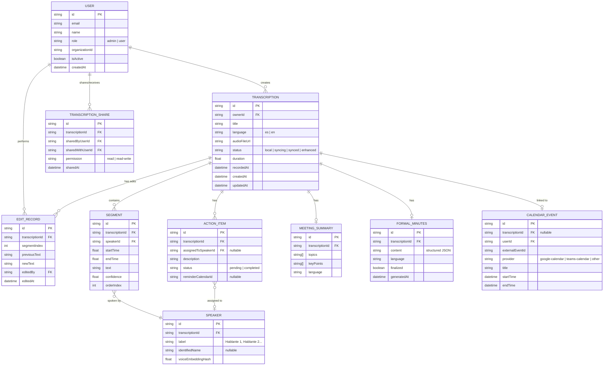
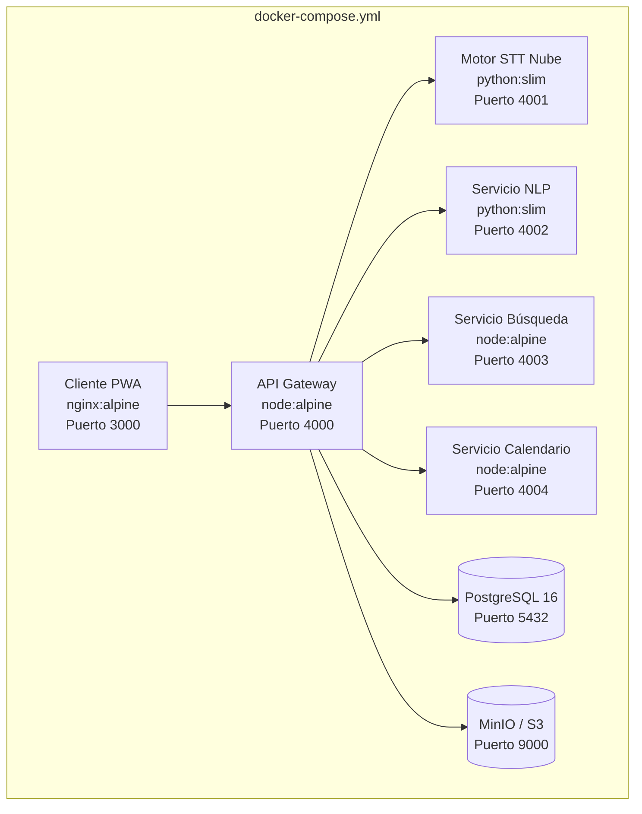

# Documento de Diseño: Sistema de Transcripción de Reuniones

## Visión General

Este documento describe el diseño técnico del sistema de transcripción de reuniones. El sistema es una Progressive Web App (PWA) que permite grabar audio de reuniones (físicas y virtuales), transcribirlo localmente usando un motor STT offline, sincronizar con la nube para re-procesamiento de mayor precisión, identificar hablantes mediante diarización, generar resúmenes automáticos con accionables, producir actas formales, y exportar transcripciones en múltiples formatos (VTT, TXT, Markdown).

La arquitectura sigue un modelo offline-first: el procesamiento inicial ocurre en el dispositivo del usuario y se sincroniza con servicios en la nube cuando hay conectividad. Soporta español e inglés.

## Arquitectura

### Diagrama de Arquitectura General



### Decisiones Arquitectónicas Clave

1. **Offline-First con PWA**: Se usa Service Worker + IndexedDB para permitir grabación y transcripción sin conexión. La sincronización ocurre en background cuando hay conectividad. Esto satisface los requisitos 1, 2 y 12.

2. **STT Local con WASM**: Se utiliza un modelo Whisper compilado a WebAssembly para transcripción en el dispositivo. Esto permite funcionalidad offline completa sin enviar audio a servidores externos.

3. **Diarización en dos fases**: Diarización básica local (basada en embeddings de voz) y refinamiento en la nube. La identificación por nombre verbal se procesa mediante NLP sobre el texto transcrito.

4. **API REST para sincronización**: Comunicación cliente-nube mediante API REST con autenticación JWT. Se usa sincronización incremental para minimizar transferencia de datos.

5. **Integración con plataformas de videoconferencia**: Captura directa vía APIs oficiales (Zoom, Teams, Meet) cuando hay permisos, con fallback a captura ambiental por micrófono.

## Componentes e Interfaces

### 1. Módulo de Captura de Audio (`AudioCaptureModule`)

Responsable de capturar audio desde el micrófono del dispositivo o desde integraciones directas con plataformas de videoconferencia.

```typescript
interface AudioCaptureModule {
  // Inicia grabación desde micrófono o integración directa
  startRecording(config: RecordingConfig): Promise<RecordingSession>;
  // Detiene grabación y guarda archivo localmente
  stopRecording(sessionId: string): Promise<AudioFile>;
  // Estado actual de la grabación
  getStatus(sessionId: string): RecordingStatus;
}

interface RecordingConfig {
  source: 'microphone' | 'zoom' | 'teams' | 'google-meet';
  language: 'es' | 'en';
  calendarEventId?: string; // Asociación con evento de calendario
}

interface RecordingSession {
  id: string;
  startedAt: Date;
  source: RecordingConfig['source'];
  status: 'recording' | 'paused' | 'stopped';
}

type RecordingStatus = {
  isRecording: boolean;
  duration: number; // segundos
  source: RecordingConfig['source'];
};
```

### 2. Motor STT Local (`LocalSTTEngine`)

Transcripción speech-to-text ejecutada en el dispositivo mediante Whisper WASM.

```typescript
interface LocalSTTEngine {
  // Transcribe audio a texto localmente
  transcribe(audio: AudioFile, language: 'es' | 'en'): Promise<RawTranscription>;
  // Verifica si el modelo está cargado y listo
  isReady(): boolean;
}

interface RawTranscription {
  segments: TranscriptionSegment[];
  language: 'es' | 'en';
  duration: number;
}

interface TranscriptionSegment {
  startTime: number;  // segundos
  endTime: number;    // segundos
  text: string;
  confidence: number; // 0-1
}
```

### 3. Diarizador (`DiarizationEngine`)

Identifica y etiqueta hablantes distintos dentro del audio.

```typescript
interface DiarizationEngine {
  // Asigna etiquetas de hablante a segmentos de transcripción
  diarize(audio: AudioFile, segments: TranscriptionSegment[]): Promise<DiarizedTranscription>;
}

interface DiarizedSegment extends TranscriptionSegment {
  speakerId: string;       // "speaker_1", "speaker_2", etc.
  speakerLabel: string;    // Nombre si fue identificado, o "Hablante 1"
  speakerConfidence: number;
}

interface DiarizedTranscription {
  segments: DiarizedSegment[];
  speakers: SpeakerProfile[];
  language: 'es' | 'en';
}

interface SpeakerProfile {
  id: string;
  label: string;           // "Hablante 1" o nombre identificado
  identifiedName?: string; // Nombre extraído del audio ("Hola, soy María")
}
```

### 4. Gestor de Sincronización (`SyncManager`)

Maneja la sincronización offline/online entre el dispositivo y la nube.

```typescript
interface SyncManager {
  // Sincroniza transcripciones y audio pendientes con la nube
  syncPending(): Promise<SyncResult>;
  // Verifica estado de conectividad
  isOnline(): boolean;
  // Registra un elemento para sincronización
  enqueue(item: SyncItem): Promise<void>;
}

interface SyncItem {
  type: 'audio' | 'transcription' | 'edit';
  localId: string;
  data: Blob | Transcription | EditRecord;
  priority: number;
}

interface SyncResult {
  synced: number;
  failed: number;
  pending: number;
}
```

### 5. Servicio NLP (`NLPService`)

Genera resúmenes, extrae accionables y produce actas formales.

```typescript
interface NLPService {
  // Genera resumen de temas principales
  generateSummary(transcription: DiarizedTranscription): Promise<MeetingSummary>;
  // Extrae accionables (tareas y compromisos)
  extractActionItems(transcription: DiarizedTranscription): Promise<ActionItem[]>;
  // Genera acta formal estructurada
  generateMinutes(transcription: DiarizedTranscription, summary: MeetingSummary, actions: ActionItem[]): Promise<FormalMinutes>;
}

interface MeetingSummary {
  topics: string[];
  keyPoints: string[];
  language: 'es' | 'en';
}

interface ActionItem {
  id: string;
  description: string;
  assignedTo: string;       // speakerId o "unassigned"
  assignedToLabel: string;  // Nombre del hablante o "Sin asignar"
  sourceSegmentId?: string;
  reminderCalendarId?: string;
}

interface FormalMinutes {
  title: string;
  date: Date;
  attendees: SpeakerProfile[];
  topicsDiscussed: string[];
  decisions: string[];
  actionItems: ActionItem[];
  language: 'es' | 'en';
}
```

### 6. Servicio de Búsqueda (`SearchService`)

Búsqueda full-text sobre transcripciones.

```typescript
interface SearchService {
  // Búsqueda full-text con filtros
  search(query: SearchQuery): Promise<SearchResult[]>;
}

interface SearchQuery {
  text: string;
  filters?: {
    dateRange?: { from: Date; to: Date };
    speakerId?: string;
    language?: 'es' | 'en';
  };
  userId: string; // Solo transcripciones accesibles por este usuario
  page?: number;
  pageSize?: number;
}

interface SearchResult {
  transcriptionId: string;
  meetingTitle: string;
  meetingDate: Date;
  matchedSegment: DiarizedSegment;
  contextBefore: string;
  contextAfter: string;
  highlightedText: string;
}
```

### 7. Servicio de Exportación (`ExportService`)

Exporta transcripciones en formatos VTT, TXT y Markdown.

```typescript
interface ExportService {
  // Exporta transcripción al formato especificado
  export(transcription: DiarizedTranscription, format: ExportFormat): string;
  // Importa transcripción desde VTT (para round-trip)
  importVTT(vttContent: string): DiarizedTranscription;
}

type ExportFormat = 'vtt' | 'txt' | 'md';
```

### 8. Servicio de Calendario (`CalendarService`)

Integración con calendarios para auto-inicio y recordatorios.

```typescript
interface CalendarService {
  // Conecta cuenta de calendario
  connect(provider: CalendarProvider): Promise<void>;
  // Obtiene próximos eventos
  getUpcomingEvents(userId: string): Promise<CalendarEvent[]>;
  // Crea recordatorio para un accionable
  createReminder(actionItem: ActionItem, calendarProvider: CalendarProvider): Promise<void>;
}

type CalendarProvider = 'google-calendar' | 'teams-calendar' | 'other';

interface CalendarEvent {
  id: string;
  title: string;
  startTime: Date;
  endTime: Date;
  participants: string[];
  meetingUrl?: string;
  provider: CalendarProvider;
}
```

### 9. Servicio de Gestión de Usuarios (`UserService`)

Control de acceso y permisos.

```typescript
interface UserService {
  // Otorga acceso a un usuario
  grantAccess(adminId: string, userId: string): Promise<void>;
  // Revoca acceso a un usuario
  revokeAccess(adminId: string, userId: string): Promise<void>;
  // Comparte transcripción con permisos específicos
  shareTranscription(ownerId: string, transcriptionId: string, targetUserId: string, permission: Permission): Promise<void>;
}

type Permission = 'read' | 'read-write';
```

### 10. Servicio de Edición (`EditService`)

Edición de transcripciones con historial.

```typescript
interface EditService {
  // Edita un segmento de transcripción
  editSegment(transcriptionId: string, segmentIndex: number, newText: string, userId: string): Promise<void>;
  // Obtiene historial de ediciones
  getEditHistory(transcriptionId: string): Promise<EditRecord[]>;
}

interface EditRecord {
  id: string;
  transcriptionId: string;
  segmentIndex: number;
  previousText: string;
  newText: string;
  editedBy: string;    // userId
  editedAt: Date;
}
```

## Modelos de Datos

### Diagrama Entidad-Relación



### Almacenamiento Local (IndexedDB)

El cliente PWA almacena en IndexedDB:
- **audioFiles**: Blobs de audio grabado pendientes de sincronización
- **transcriptions**: Transcripciones locales (con segmentos y hablantes embebidos)
- **syncQueue**: Cola de elementos pendientes de sincronización
- **settings**: Configuración del usuario (calendario conectado, idioma preferido)


## Propiedades de Correctitud

*Una propiedad es una característica o comportamiento que debe mantenerse verdadero en todas las ejecuciones válidas de un sistema — esencialmente, una declaración formal sobre lo que el sistema debe hacer. Las propiedades sirven como puente entre especificaciones legibles por humanos y garantías de correctitud verificables por máquina.*

### Propiedad 1: Sincronización completa de elementos pendientes

*Para toda* cola de sincronización con elementos pendientes, cuando el dispositivo pasa a estado online, todos los elementos en la cola deben ser procesados y sincronizados con la nube, y la cola debe quedar vacía (o contener solo elementos que fallaron con reintentos programados).

**Valida: Requisitos 2.3, 12.3**

### Propiedad 2: Reemplazo por transcripción mejorada

*Para toda* transcripción que recibe una versión mejorada del Motor_STT_Nube, la transcripción almacenada localmente debe ser reemplazada por la versión mejorada, y el estado de la transcripción debe cambiar a "enhanced".

**Valida: Requisito 2.5**

### Propiedad 3: Consistencia de identificación de hablantes

*Para toda* transcripción diarizada, cada `speakerId` debe mapear a exactamente un `speakerLabel` a lo largo de toda la transcripción, y todo segmento con confianza de hablante por debajo del umbral debe tener la etiqueta "Hablante no identificado".

**Valida: Requisitos 3.1, 3.3, 3.4**

### Propiedad 4: Persistencia de nombre de hablante identificado

*Para todo* hablante que se identifica verbalmente por su nombre en un segmento, todos los segmentos posteriores de ese mismo `speakerId` deben usar el nombre identificado como `speakerLabel`.

**Valida: Requisito 3.2**

### Propiedad 5: Generación de resumen y accionables post-transcripción

*Para toda* transcripción con estado "completa", el sistema debe generar tanto un `MeetingSummary` (con al menos un tema) como una lista de `ActionItem[]` (que puede estar vacía). Ambos artefactos deben existir asociados a la transcripción.

**Valida: Requisitos 5.1, 5.2**

### Propiedad 6: Asignación de accionables a hablantes

*Para todo* accionable extraído de una transcripción, el campo `assignedTo` debe referenciar un `speakerId` válido presente en la transcripción, o tener el valor "unassigned" con `assignedToLabel` igual a "Sin asignar" cuando no se puede determinar el hablante.

**Valida: Requisitos 5.3, 5.5**

### Propiedad 7: Completitud y coherencia de actas formales

*Para toda* acta formal generada, el documento debe contener las cuatro secciones requeridas (asistentes, temas tratados, decisiones, accionables), los asistentes deben corresponder a los hablantes de la transcripción, y el campo `language` del acta debe coincidir con el campo `language` de la transcripción fuente.

**Valida: Requisitos 6.1, 6.2**

### Propiedad 8: Correctitud de búsqueda con filtros y control de acceso

*Para toda* consulta de búsqueda con filtros (rango de fechas, hablante, idioma), todos los resultados devueltos deben: (a) pertenecer a transcripciones accesibles por el usuario (propias o compartidas), (b) satisfacer todos los filtros aplicados, y (c) contener el fragmento coincidente con contexto, información del hablante y fecha de la reunión.

**Valida: Requisitos 7.1, 7.2, 7.3, 9.3**

### Propiedad 9: Enforcement de permisos de edición

*Para todo* intento de edición de una transcripción, la operación debe tener éxito únicamente si el usuario es el propietario de la transcripción o tiene permiso "read-write" mediante un `TranscriptionShare`. Cualquier otro intento debe ser rechazado.

**Valida: Requisito 8.1**

### Propiedad 10: Integridad del log de ediciones y propiedad de transcripciones

*Para toda* edición realizada sobre una transcripción, debe crearse un `EditRecord` con el `editedBy` correspondiente al usuario que realizó la edición y un `editedAt` válido. Además, toda transcripción creada debe tener un `ownerId` que corresponda al usuario que la creó.

**Valida: Requisitos 8.2, 9.2**

### Propiedad 11: Control de acceso — otorgar y revocar

*Para todo* usuario al que un administrador le otorga acceso, el usuario debe poder acceder al sistema. *Para todo* usuario al que un administrador le revoca acceso, el usuario debe dejar de poder acceder al sistema. La operación de otorgar seguida de revocar debe resultar en acceso denegado, y viceversa.

**Valida: Requisitos 9.1, 9.3**

### Propiedad 12: Preservación de estructura en exportación

*Para toda* transcripción exportada en cualquier formato (VTT, TXT, Markdown), el archivo resultante debe contener las marcas de hablante, los timestamps y el texto de cada segmento, preservando la estructura de la transcripción original.

**Valida: Requisitos 10.1, 10.2, 10.3**

### Propiedad 13: Round-trip de exportación/importación VTT

*Para toda* transcripción válida, exportar a formato VTT y luego importar el archivo VTT resultante debe producir una transcripción equivalente a la original (mismos segmentos, hablantes, timestamps y texto).

**Valida: Requisito 10.4**

### Propiedad 14: Auto-inicio de grabación por calendario

*Para todo* evento de calendario cuyo `startTime` está dentro del umbral de notificación, el sistema debe generar una notificación al usuario. Si el usuario acepta, la grabación debe iniciarse en modo "integración directa" cuando la reunión tiene URL de videoconferencia compatible, o en modo "ambiental" en caso contrario.

**Valida: Requisitos 11.2, 11.3**

### Propiedad 15: Asociación transcripción-evento de calendario

*Para toda* transcripción creada mediante auto-inicio desde un evento de calendario, la transcripción debe tener un `calendarEventId` que referencia al evento original, y el título de la reunión y participantes invitados deben estar asociados.

**Valida: Requisito 11.4**

## Dockerización

### Arquitectura de Contenedores



### Estructura de Dockerfiles

Cada servicio tiene su propio Dockerfile con multi-stage build:

```
/
├── docker-compose.yml
├── docker-compose.dev.yml
├── .env.example
├── client/
│   └── Dockerfile          # Stage 1: build PWA, Stage 2: nginx:alpine
├── services/
│   ├── api-gateway/
│   │   └── Dockerfile      # Stage 1: build TS, Stage 2: node:alpine
│   ├── stt-cloud/
│   │   └── Dockerfile      # Stage 1: deps, Stage 2: python:slim
│   ├── nlp-service/
│   │   └── Dockerfile      # Stage 1: deps, Stage 2: python:slim
│   ├── search-service/
│   │   └── Dockerfile      # Stage 1: build TS, Stage 2: node:alpine
│   └── calendar-service/
│       └── Dockerfile      # Stage 1: build TS, Stage 2: node:alpine
```

### Configuración por Variables de Entorno

Toda configuración sensible se maneja mediante variables de entorno:

| Variable | Servicio | Descripción |
|----------|----------|-------------|
| `DATABASE_URL` | api-gateway | Connection string PostgreSQL |
| `S3_ENDPOINT` | api-gateway | URL de MinIO/S3 para audio |
| `S3_ACCESS_KEY` / `S3_SECRET_KEY` | api-gateway | Credenciales de almacenamiento |
| `JWT_SECRET` | api-gateway | Secreto para tokens JWT |
| `GOOGLE_CLIENT_ID` / `GOOGLE_CLIENT_SECRET` | calendar-service | OAuth Google Calendar |
| `TEAMS_CLIENT_ID` / `TEAMS_CLIENT_SECRET` | calendar-service | OAuth Microsoft Teams |
| `ZOOM_API_KEY` / `ZOOM_API_SECRET` | api-gateway | Integración Zoom |
| `STT_MODEL_PATH` | stt-cloud | Ruta al modelo Whisper en nube |
| `NLP_MODEL_NAME` | nlp-service | Modelo de NLP para resúmenes |

### Health Checks

Cada contenedor expone un endpoint `/health` que retorna:
- `200 OK` con `{"status": "healthy"}` cuando el servicio está operativo
- `503 Service Unavailable` cuando el servicio no puede atender requests

Docker Compose configura health checks con `interval: 30s`, `timeout: 10s`, `retries: 3`.

### Decisiones de Dockerización

1. **Multi-stage builds**: Reducen el tamaño de imágenes de producción separando dependencias de build de las de runtime.
2. **Alpine/Slim base images**: Minimizan superficie de ataque y tamaño de imagen.
3. **MinIO como S3-compatible**: Permite desarrollo local sin depender de AWS S3, con la misma API.
4. **docker-compose.dev.yml**: Override para desarrollo con hot-reload, volúmenes montados y puertos expuestos para debugging.

## Manejo de Errores

### Errores de Captura de Audio

| Error | Causa | Manejo |
|-------|-------|--------|
| Micrófono no disponible | Permisos denegados o hardware ausente | Mostrar mensaje claro solicitando permisos. No iniciar grabación. |
| Pérdida de señal de audio | Desconexión de micrófono durante grabación | Pausar grabación, notificar al usuario, guardar audio capturado hasta el momento. |
| Fallo de integración directa | API de videoconferencia no responde | Ofrecer fallback a captura ambiental con notificación al usuario. |

### Errores de Transcripción

| Error | Causa | Manejo |
|-------|-------|--------|
| Modelo WASM no cargado | Fallo de descarga o memoria insuficiente | Reintentar carga. Si falla, encolar para transcripción en nube cuando haya conexión. |
| Transcripción vacía | Audio sin voz detectable | Notificar al usuario. Guardar audio para re-procesamiento manual. |
| Idioma no detectado | Audio ambiguo o muy corto | Usar idioma por defecto del usuario. Permitir cambio manual. |

### Errores de Sincronización

| Error | Causa | Manejo |
|-------|-------|--------|
| Fallo de conexión durante sync | Red inestable | Reintento exponencial (backoff). Mantener en cola de sincronización. |
| Conflicto de versiones | Edición simultánea en múltiples dispositivos | Estrategia last-write-wins con preservación de ambas versiones en historial. |
| Almacenamiento en nube lleno | Cuota excedida | Notificar al usuario. Mantener datos locales. Sugerir limpieza. |

### Errores de Diarización

| Error | Causa | Manejo |
|-------|-------|--------|
| No se distinguen hablantes | Audio de baja calidad o un solo canal | Marcar todos los segmentos como "Hablante no identificado". Permitir asignación manual. |
| Demasiados hablantes detectados | Ruido de fondo interpretado como hablantes | Permitir al usuario fusionar hablantes manualmente en la edición. |

### Errores de Integración con Calendario

| Error | Causa | Manejo |
|-------|-------|--------|
| Token de calendario expirado | Sesión OAuth caducada | Solicitar re-autenticación. No perder eventos ya sincronizados. |
| Evento no encontrado | Evento eliminado o modificado externamente | Notificar al usuario. Permitir asociación manual de transcripción. |

### Errores de Exportación

| Error | Causa | Manejo |
|-------|-------|--------|
| Transcripción corrupta | Datos incompletos en segmentos | Exportar segmentos válidos. Marcar segmentos faltantes con placeholder. |
| Formato VTT inválido en importación | Archivo VTT malformado | Retornar error descriptivo indicando la línea del problema. No modificar datos existentes. |

## Estrategia de Testing

### Enfoque Dual: Tests Unitarios + Tests Basados en Propiedades

El sistema utiliza un enfoque complementario de testing:

- **Tests unitarios**: Verifican ejemplos específicos, casos borde y condiciones de error
- **Tests basados en propiedades**: Verifican propiedades universales sobre todos los inputs válidos

Ambos son necesarios para cobertura completa.

### Librería de Property-Based Testing

Se utilizará **fast-check** (JavaScript/TypeScript) como librería de property-based testing. Cada test de propiedad debe ejecutar un mínimo de 100 iteraciones.

### Configuración de Tests de Propiedades

Cada test de propiedad debe:
- Referenciar la propiedad del documento de diseño mediante un comentario
- Usar el formato de tag: **Feature: meeting-transcription, Property {número}: {texto de la propiedad}**
- Ejecutar mínimo 100 iteraciones
- Cada propiedad de correctitud debe ser implementada por UN SOLO test basado en propiedades

### Tests Unitarios

Los tests unitarios deben cubrir:

1. **Ejemplos específicos**:
   - Iniciar y detener una grabación correctamente (Req 1.1, 1.5)
   - Transcripción local produce output para audio en español e inglés (Req 2.1, 2.2)
   - Re-procesamiento en nube se dispara tras sincronización (Req 2.4)
   - Fallback a captura ambiental cuando no hay permisos de integración (Req 4.2)
   - Compartir transcripción con permisos de solo lectura y lectura-edición (Req 9.4)
   - Agregar recordatorio de accionable en calendario (Req 5.4)

2. **Casos borde**:
   - Grabación con audio vacío (sin voz)
   - Transcripción con un solo hablante
   - Búsqueda sin resultados
   - Exportación de transcripción sin segmentos
   - Sincronización con cola vacía
   - Accionable sin hablante asignable (Req 5.5)
   - Segmento con confianza de hablante bajo umbral (Req 3.4)

3. **Condiciones de error**:
   - Micrófono no disponible
   - Modelo WASM no cargado
   - Fallo de red durante sincronización
   - Token de calendario expirado
   - Archivo VTT malformado en importación
   - Intento de edición sin permisos

### Tests Basados en Propiedades

| Propiedad | Descripción | Generadores |
|-----------|-------------|-------------|
| 1 | Sincronización completa de elementos pendientes | Generar colas de sync con items aleatorios (audio, transcripción, edición) |
| 2 | Reemplazo por transcripción mejorada | Generar pares de transcripción local + versión mejorada |
| 3 | Consistencia de identificación de hablantes | Generar transcripciones con N hablantes aleatorios y segmentos con confianza variable |
| 4 | Persistencia de nombre de hablante identificado | Generar secuencias de segmentos donde un hablante se identifica en un punto aleatorio |
| 5 | Generación de resumen y accionables | Generar transcripciones completas con contenido variado |
| 6 | Asignación de accionables a hablantes | Generar accionables con speakerIds válidos e inválidos |
| 7 | Completitud de actas formales | Generar transcripciones con idioma aleatorio (es/en) y hablantes variados |
| 8 | Búsqueda con filtros y control de acceso | Generar conjuntos de transcripciones con distintos propietarios, permisos y filtros |
| 9 | Enforcement de permisos de edición | Generar combinaciones de usuario/transcripción/permiso |
| 10 | Integridad del log de ediciones | Generar secuencias de ediciones por distintos usuarios |
| 11 | Control de acceso — otorgar y revocar | Generar secuencias de operaciones grant/revoke |
| 12 | Preservación de estructura en exportación | Generar transcripciones aleatorias y exportar a cada formato |
| 13 | Round-trip VTT | Generar transcripciones aleatorias con hablantes, timestamps y texto variado |
| 14 | Auto-inicio por calendario | Generar eventos de calendario con distintos tiempos y tipos de reunión |
| 15 | Asociación transcripción-evento | Generar transcripciones creadas desde eventos de calendario |
