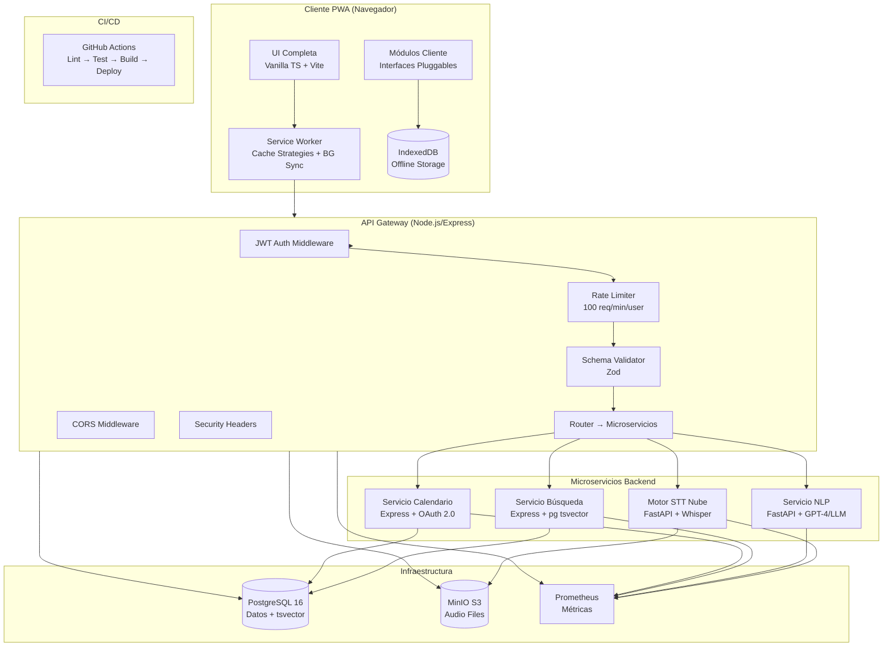
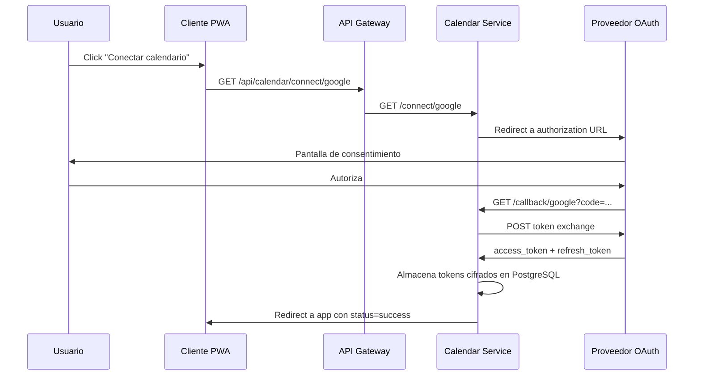
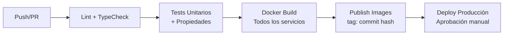
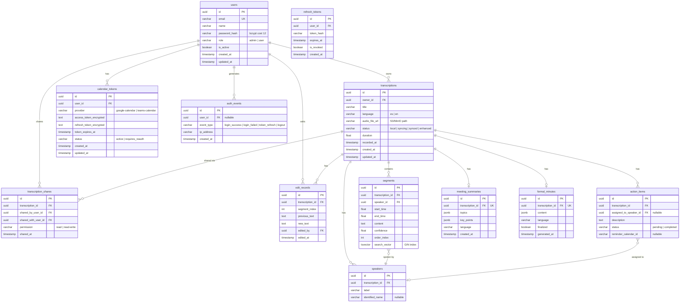

# Documento de Diseño: Preparación para Producción

## Visión General

Este documento describe el diseño técnico para llevar a producción la aplicación KeepWeChat (PWA de transcripción de reuniones). El sistema cliente está completamente implementado con backends pluggables (stubs). Este spec cubre la implementación real de todos los servicios backend, la migración a PostgreSQL, la UI completa, el Service Worker robusto, la seguridad, el monitoreo y el pipeline CI/CD.

La estrategia es reemplazar los stubs existentes por implementaciones reales sin modificar las interfaces del cliente, aprovechando la arquitectura pluggable ya establecida.

## Arquitectura

### Diagrama de Arquitectura de Producción



### Decisiones Arquitectónicas Clave

1. **Reemplazo de stubs sin cambio de interfaces**: Los módulos cliente (`SyncTransport`, `CloudSTTService`, `CalendarBackend`, `NLPBackend`, etc.) ya definen interfaces pluggables. Las implementaciones reales se inyectan en runtime.

2. **API Gateway como punto único de entrada**: Centraliza autenticación JWT, rate limiting, validación de esquemas y CORS. Los microservicios internos no exponen puertos al exterior.

3. **PostgreSQL como fuente de verdad**: Reemplaza el almacenamiento in-memory de los servicios. Se usa tsvector para búsqueda full-text con soporte multiidioma (español/inglés).

4. **FastAPI para servicios Python**: STT (Whisper) y NLP (GPT-4) usan FastAPI por su soporte nativo de async, validación con Pydantic y documentación automática.

5. **Service Worker con estrategias diferenciadas**: Cache-first para assets estáticos con versionado, network-first para API con fallback offline, background sync para operaciones pendientes.

6. **Migraciones versionadas con node-pg-migrate**: Esquema de BD controlado por migraciones que se ejecutan al inicio de cada servicio.

7. **Monitoreo con prom-client + logging JSON**: Cada servicio expone `/metrics` compatible con Prometheus y emite logs estructurados en JSON.


## Componentes e Interfaces

### 1. API Gateway (Node.js/Express)

Punto de entrada único para todas las peticiones del cliente. Implementa autenticación, rate limiting, validación y routing.

#### Dependencias principales
- `express`, `jsonwebtoken`, `bcrypt`, `zod`, `helmet`, `cors`, `express-rate-limit`, `pg`, `prom-client`, `winston`

#### Endpoints REST

```
POST   /api/auth/register          → Registro de usuario
POST   /api/auth/login             → Login (retorna access + refresh token)
POST   /api/auth/refresh           → Renovar access token
POST   /api/auth/logout            → Invalidar refresh token

GET    /api/transcriptions         → Listar transcripciones del usuario
POST   /api/transcriptions         → Crear transcripción (sync desde cliente)
GET    /api/transcriptions/:id     → Obtener transcripción por ID
PUT    /api/transcriptions/:id     → Actualizar transcripción
DELETE /api/transcriptions/:id     → Eliminar transcripción

POST   /api/transcriptions/:id/segments/:idx/edit → Editar segmento
GET    /api/transcriptions/:id/edits               → Historial de ediciones

POST   /api/transcriptions/:id/share   → Compartir transcripción
GET    /api/transcriptions/:id/share   → Listar comparticiones

POST   /api/stt/transcribe         → Proxy a STT Cloud (upload audio)
POST   /api/nlp/summary            → Proxy a NLP (generar resumen)
POST   /api/nlp/actions            → Proxy a NLP (extraer accionables)
POST   /api/nlp/minutes            → Proxy a NLP (generar acta)

GET    /api/search                 → Búsqueda full-text
GET    /api/search/suggestions     → Sugerencias de búsqueda

GET    /api/calendar/events        → Eventos próximos
POST   /api/calendar/connect       → Iniciar flujo OAuth
GET    /api/calendar/callback      → Callback OAuth
POST   /api/calendar/reminders     → Crear recordatorio

POST   /api/sync                   → Sincronizar batch de items
GET    /api/export/:id/:format     → Exportar transcripción

GET    /health                     → Health check
GET    /metrics                    → Métricas Prometheus
```

#### Middleware Stack

```typescript
// Orden de middlewares en el pipeline de Express
interface MiddlewareStack {
  // 1. Security headers (helmet)
  securityHeaders: {
    contentSecurityPolicy: string;
    xContentTypeOptions: 'nosniff';
    xFrameOptions: 'DENY';
    strictTransportSecurity: { maxAge: 31536000; includeSubDomains: true };
  };
  // 2. CORS (orígenes desde env ALLOWED_ORIGINS)
  cors: { origin: string[]; credentials: true };
  // 3. JSON body parser
  bodyParser: { limit: '50mb' }; // para audio uploads
  // 4. Request ID + structured logging
  requestLogger: { format: 'json'; fields: ['timestamp', 'level', 'service', 'requestId', 'message'] };
  // 5. JWT authentication (excepto /health, /auth/login, /auth/register)
  jwtAuth: {
    accessTokenExpiry: '15m';
    refreshTokenExpiry: '7d';
    algorithm: 'HS256';
  };
  // 6. Rate limiting
  rateLimiter: { windowMs: 60000; max: 100; keyGenerator: 'userId' };
  // 7. Schema validation (Zod)
  schemaValidator: 'per-route';
}
```

#### Interfaces TypeScript del Gateway

```typescript
interface JWTPayload {
  userId: string;
  role: 'admin' | 'user';
  iat: number;
  exp: number;
}

interface AuthTokens {
  accessToken: string;
  refreshToken: string;
}

interface ValidationError {
  field: string;
  message: string;
}

interface APIErrorResponse {
  error: string;
  code: number;
  details?: ValidationError[];
  retryAfter?: number; // para 429
}
```

### 2. Motor STT Nube (FastAPI + Whisper)

Servicio Python que transcribe audio usando OpenAI Whisper.

#### Dependencias principales
- `fastapi`, `uvicorn`, `openai-whisper`, `torch`, `python-multipart`, `prometheus-client`

#### Endpoints

```
POST /transcribe     → Recibe audio, retorna transcripción JSON
GET  /health         → Health check
GET  /metrics        → Métricas Prometheus
```

#### Interfaz de Request/Response

```python
# Request: multipart/form-data
# - file: archivo de audio (WAV, WebM, OGG)
# - language: "es" | "en" (opcional, auto-detect si no se envía)

# Response: JSON compatible con RawTranscription del cliente
class TranscriptionSegment(BaseModel):
    startTime: float    # segundos
    endTime: float      # segundos
    text: str
    confidence: float   # 0-1

class TranscriptionResponse(BaseModel):
    segments: list[TranscriptionSegment]
    language: str       # "es" | "en"
    duration: float     # segundos
```

#### Formatos soportados
- WAV (audio/wav)
- WebM (audio/webm) — formato nativo de MediaRecorder
- OGG (audio/ogg)

Archivos en formato no soportado o corruptos retornan HTTP 400 con mensaje descriptivo.

### 3. Servicio NLP (FastAPI + LLM)

Servicio Python que genera resúmenes, extrae accionables y produce actas formales usando un modelo de lenguaje.

#### Dependencias principales
- `fastapi`, `uvicorn`, `openai` (SDK), `prometheus-client`

#### Endpoints

```
POST /summary        → Generar resumen de temas
POST /actions        → Extraer accionables
POST /minutes        → Generar acta formal
GET  /health         → Health check
GET  /metrics        → Métricas Prometheus
```

#### Interfaces

```python
class DiarizedSegmentInput(BaseModel):
    startTime: float
    endTime: float
    text: str
    confidence: float
    speakerId: str
    speakerLabel: str
    speakerConfidence: float

class SpeakerInput(BaseModel):
    id: str
    label: str
    identifiedName: str | None = None

class TranscriptionInput(BaseModel):
    segments: list[DiarizedSegmentInput]
    speakers: list[SpeakerInput]
    language: str  # "es" | "en"

# Respuestas compatibles con interfaces del cliente
class SummaryResponse(BaseModel):
    topics: list[str]
    keyPoints: list[str]
    language: str

class ActionItemResponse(BaseModel):
    id: str
    description: str
    assignedTo: str
    assignedToLabel: str
    sourceSegmentId: str | None = None

class MinutesResponse(BaseModel):
    title: str
    date: str
    attendees: list[SpeakerInput]
    topicsDiscussed: list[str]
    decisions: list[str]
    actionItems: list[ActionItemResponse]
    language: str
```

El servicio genera respuestas en el mismo idioma de la transcripción fuente. Si el LLM no está disponible, retorna HTTP 503.

### 4. Servicio de Búsqueda (Express + PostgreSQL tsvector)

Implementa búsqueda full-text sobre segmentos de transcripción usando índices tsvector de PostgreSQL.

#### Dependencias principales
- `express`, `pg`, `prom-client`, `winston`

#### Endpoints

```
GET  /search?q=...&dateFrom=...&dateTo=...&speaker=...&lang=...&page=...
POST /index              → Indexar transcripción (llamado internamente)
GET  /health             → Health check
GET  /metrics            → Métricas Prometheus
```

#### Lógica de búsqueda

```sql
-- Búsqueda full-text con tsvector
SELECT s.*, t.title, t.recorded_at, t.owner_id
FROM segments s
JOIN transcriptions t ON s.transcription_id = t.id
WHERE s.search_vector @@ plainto_tsquery($config, $query)
  AND (t.owner_id = $userId OR EXISTS (
    SELECT 1 FROM transcription_shares ts
    WHERE ts.transcription_id = t.id AND ts.shared_with_user_id = $userId
  ))
  AND ($dateFrom IS NULL OR t.recorded_at >= $dateFrom)
  AND ($dateTo IS NULL OR t.recorded_at <= $dateTo)
  AND ($speakerId IS NULL OR s.speaker_id = $speakerId)
ORDER BY ts_rank(s.search_vector, plainto_tsquery($config, $query)) DESC
LIMIT $pageSize OFFSET $offset;
```

La configuración de diccionario se selecciona según el idioma: `spanish` para `es`, `english` para `en`.

### 5. Servicio de Calendario (Express + OAuth 2.0)

Implementa flujo OAuth completo para Google Calendar y Microsoft Teams Calendar.

#### Dependencias principales
- `express`, `googleapis`, `@azure/msal-node`, `pg`, `prom-client`, `winston`

#### Endpoints

```
GET  /connect/:provider       → Redirige a OAuth del proveedor
GET  /callback/:provider      → Callback OAuth, almacena tokens
GET  /events                  → Eventos próximos del usuario
POST /reminders               → Crear recordatorio en calendario
GET  /health                  → Health check
GET  /metrics                 → Métricas Prometheus
```

#### Flujo OAuth



#### Renovación automática de tokens

Cuando un access token expira, el servicio usa el refresh token para obtener uno nuevo. Si la renovación falla (refresh token revocado), se marca el estado como `requires_reauth` y se notifica al usuario.

### 6. Service Worker Completo

Reemplaza el Service Worker básico actual (`src/sw.ts`) con estrategias de cache robustas y background sync.

#### Estrategias de Cache

```typescript
interface CacheStrategies {
  // Assets estáticos: cache-first con actualización en background
  staticAssets: {
    strategy: 'CacheFirst';
    cacheName: 'static-v{hash}';
    match: /\.(js|css|html|svg|woff2|png|jpg)$/;
    plugins: ['StaleWhileRevalidate'];
  };
  // API requests: network-first con fallback a cache
  apiRequests: {
    strategy: 'NetworkFirst';
    cacheName: 'api-cache';
    match: /^\/api\//;
    networkTimeoutSeconds: 5;
    fallback: 'cached-response | offline-page';
  };
  // Página de fallback offline
  offlineFallback: {
    url: '/offline.html';
    cacheName: 'offline-fallback';
  };
}
```

#### Background Sync

```typescript
interface BackgroundSyncConfig {
  // Encolar peticiones fallidas para reintento
  syncTag: 'sync-pending';
  // Tipos de operaciones encolables
  operations: ['transcription-sync', 'edit-sync', 'audio-upload'];
  // Reintento con backoff exponencial
  retryStrategy: {
    maxRetries: 5;
    baseDelay: 1000; // ms
  };
}
```

#### Notificación de actualización

Cuando una nueva versión del SW está disponible, se envía un mensaje al cliente para mostrar un banner "Nueva versión disponible — Actualizar".

### 7. Interfaz de Usuario Completa

Las pantallas UI ya tienen estructura base en `src/ui/`. Se completan con funcionalidad real:

| Pantalla | Archivo | Estado actual | Trabajo pendiente |
|----------|---------|---------------|-------------------|
| Dashboard | `dashboard-screen.ts` | Implementada | Conectar a API real, paginación |
| Grabación | `recording-screen.ts` | Implementada | Indicador de calidad de audio |
| Detalle transcripción | `transcription-detail-screen.ts` | Implementada | Edición inline real, compartir |
| Búsqueda | `search-screen.ts` | Mockup estático | Conectar a API de búsqueda real |
| Actas formales | `minutes-view.ts` | Implementada | Conectar a NLP real |
| Historial ediciones | `edit-history.ts` | Implementada | Conectar a API real |
| Exportación | `export-panel.ts` | Implementada | Ya funcional |

Todas las pantallas deben ser responsive (desktop, tablet, móvil) usando CSS media queries y layout flexible ya definido en `styles.ts`.

### 8. Sistema de Monitoreo

#### Logging estructurado

```typescript
interface LogEntry {
  timestamp: string;      // ISO 8601
  level: 'info' | 'warn' | 'error';
  service: string;        // nombre del microservicio
  requestId: string;      // UUID por request
  message: string;
  metadata?: Record<string, unknown>;
  error?: {
    name: string;
    message: string;
    stack: string;
  };
}
```

#### Métricas Prometheus

Cada servicio expone en `/metrics`:
- `http_request_duration_seconds` (histogram) — latencia p50, p95, p99
- `http_requests_total` (counter) — total de requests por método, ruta, status
- `http_request_errors_total` (counter) — tasa de errores
- `process_cpu_seconds_total`, `process_resident_memory_bytes` — uso de recursos

#### Alertas

Regla de alerta: si `rate(http_request_errors_total[5m]) / rate(http_requests_total[5m]) > 0.05`, generar alerta.

### 9. Pipeline CI/CD (GitHub Actions)



#### Stages

1. **Lint + TypeCheck**: `tsc --noEmit` + ESLint en todos los servicios TS
2. **Tests**: `vitest --run` (unitarios + propiedades con fast-check)
3. **Docker Build**: Build de todas las imágenes, verificar que compilan sin error
4. **Publish**: Solo en rama principal, tag con hash del commit
5. **Deploy**: Requiere aprobación manual, despliega con docker-compose


## Modelos de Datos

### Esquema PostgreSQL



### Migraciones

Las migraciones se gestionan con `node-pg-migrate` y se ejecutan al inicio de cada servicio Node.js. Los servicios Python usan `alembic` o scripts SQL directos.

#### Estructura de migraciones

```
services/
  api-gateway/
    migrations/
      001_create_users.sql
      002_create_transcriptions.sql
      003_create_segments_with_tsvector.sql
      004_create_speakers.sql
      005_create_action_items.sql
      006_create_summaries_minutes.sql
      007_create_edit_records.sql
      008_create_shares.sql
      009_create_calendar_tokens.sql
      010_create_refresh_tokens.sql
      011_create_auth_events.sql
      012_create_indexes.sql
```

### Índices

```sql
-- Búsquedas frecuentes
CREATE INDEX idx_transcriptions_owner_id ON transcriptions(owner_id);
CREATE INDEX idx_transcriptions_recorded_at ON transcriptions(recorded_at);
CREATE INDEX idx_segments_transcription_id ON segments(transcription_id);
CREATE INDEX idx_segments_speaker_id ON segments(speaker_id);

-- Búsqueda full-text con GIN
CREATE INDEX idx_segments_search_vector ON segments USING GIN(search_vector);

-- Trigger para actualizar search_vector automáticamente
CREATE OR REPLACE FUNCTION update_search_vector() RETURNS trigger AS $$
BEGIN
  NEW.search_vector := to_tsvector(
    CASE
      WHEN (SELECT language FROM transcriptions WHERE id = NEW.transcription_id) = 'es'
      THEN 'spanish'
      ELSE 'english'
    END,
    NEW.content
  );
  RETURN NEW;
END;
$$ LANGUAGE plpgsql;

CREATE TRIGGER trg_segments_search_vector
  BEFORE INSERT OR UPDATE OF content ON segments
  FOR EACH ROW EXECUTE FUNCTION update_search_vector();

-- Otros índices
CREATE INDEX idx_edit_records_transcription_id ON edit_records(transcription_id);
CREATE INDEX idx_shares_transcription_id ON transcription_shares(transcription_id);
CREATE INDEX idx_shares_shared_with ON transcription_shares(shared_with_user_id);
CREATE INDEX idx_action_items_transcription_id ON action_items(transcription_id);
CREATE INDEX idx_calendar_tokens_user_provider ON calendar_tokens(user_id, provider);
CREATE INDEX idx_auth_events_user_id ON auth_events(user_id);
CREATE INDEX idx_refresh_tokens_user_id ON refresh_tokens(user_id);
```

### Foreign Keys y Constraints

```sql
-- Integridad referencial
ALTER TABLE transcriptions ADD CONSTRAINT fk_transcriptions_owner
  FOREIGN KEY (owner_id) REFERENCES users(id) ON DELETE CASCADE;

ALTER TABLE segments ADD CONSTRAINT fk_segments_transcription
  FOREIGN KEY (transcription_id) REFERENCES transcriptions(id) ON DELETE CASCADE;

ALTER TABLE segments ADD CONSTRAINT fk_segments_speaker
  FOREIGN KEY (speaker_id) REFERENCES speakers(id) ON DELETE SET NULL;

ALTER TABLE speakers ADD CONSTRAINT fk_speakers_transcription
  FOREIGN KEY (transcription_id) REFERENCES transcriptions(id) ON DELETE CASCADE;

ALTER TABLE action_items ADD CONSTRAINT fk_action_items_transcription
  FOREIGN KEY (transcription_id) REFERENCES transcriptions(id) ON DELETE CASCADE;

ALTER TABLE edit_records ADD CONSTRAINT fk_edit_records_transcription
  FOREIGN KEY (transcription_id) REFERENCES transcriptions(id) ON DELETE CASCADE;

ALTER TABLE edit_records ADD CONSTRAINT fk_edit_records_user
  FOREIGN KEY (edited_by) REFERENCES users(id);

ALTER TABLE transcription_shares ADD CONSTRAINT fk_shares_transcription
  FOREIGN KEY (transcription_id) REFERENCES transcriptions(id) ON DELETE CASCADE;

ALTER TABLE transcription_shares ADD CONSTRAINT fk_shares_shared_by
  FOREIGN KEY (shared_by_user_id) REFERENCES users(id);

ALTER TABLE transcription_shares ADD CONSTRAINT fk_shares_shared_with
  FOREIGN KEY (shared_with_user_id) REFERENCES users(id);

-- Constraints
ALTER TABLE segments ADD CONSTRAINT chk_segments_times
  CHECK (start_time >= 0 AND end_time > start_time);

ALTER TABLE segments ADD CONSTRAINT chk_segments_confidence
  CHECK (confidence >= 0 AND confidence <= 1);

ALTER TABLE users ADD CONSTRAINT chk_users_role
  CHECK (role IN ('admin', 'user'));

ALTER TABLE transcriptions ADD CONSTRAINT chk_transcriptions_language
  CHECK (language IN ('es', 'en'));

ALTER TABLE transcription_shares ADD CONSTRAINT chk_shares_permission
  CHECK (permission IN ('read', 'read-write'));

ALTER TABLE transcription_shares ADD CONSTRAINT uq_shares_unique
  UNIQUE (transcription_id, shared_with_user_id);
```


## Propiedades de Correctitud

*Una propiedad es una característica o comportamiento que debe mantenerse verdadero en todas las ejecuciones válidas de un sistema — esencialmente, una declaración formal sobre lo que el sistema debe hacer. Las propiedades sirven como puente entre especificaciones legibles por humanos y garantías de correctitud verificables por máquina.*

### Propiedad 1: Validación JWT rechaza tokens inválidos

*Para todo* token JWT que sea inválido (malformado, firmado con secreto incorrecto, o expirado), el API Gateway debe rechazar la petición con código HTTP 401 y no enrutar la petición al microservicio destino.

**Valida: Requisitos 1.2, 1.3**

### Propiedad 2: Rate limiting por usuario

*Para todo* usuario autenticado, si el número de peticiones en una ventana de 60 segundos supera 100, las peticiones adicionales deben ser rechazadas con código HTTP 429 y un header `Retry-After` con valor positivo.

**Valida: Requisitos 1.4, 1.5**

### Propiedad 3: Validación de esquema de peticiones

*Para todo* cuerpo de petición que no cumple el esquema Zod definido para la ruta, el API Gateway debe responder con código HTTP 400 y una lista de campos con errores de validación. Peticiones con cuerpo válido deben ser aceptadas.

**Valida: Requisitos 1.6, 1.7**

### Propiedad 4: CORS rechaza orígenes no autorizados

*Para toda* petición HTTP con un header `Origin` que no está en la lista de orígenes autorizados (definida en variables de entorno), el API Gateway no debe incluir el header `Access-Control-Allow-Origin` en la respuesta.

**Valida: Requisito 1.8**

### Propiedad 5: Respuesta STT compatible con RawTranscription

*Para todo* archivo de audio válido procesado por el Motor STT Nube, la respuesta JSON debe ser deserializable en la interfaz `RawTranscription` del cliente: un array de segmentos donde cada segmento tiene `startTime` (≥ 0), `endTime` (> startTime), `text` (no vacío) y `confidence` (entre 0 y 1), más campos `language` y `duration`.

**Valida: Requisitos 2.1, 2.5**

### Propiedad 6: Resumen NLP contiene al menos un tema

*Para toda* transcripción diarizada enviada al Servicio NLP, el resumen generado debe contener al menos un tema en el array `topics` y el campo `language` debe estar presente.

**Valida: Requisito 3.1**

### Propiedad 7: Accionables NLP referencian hablantes válidos

*Para todo* accionable extraído por el Servicio NLP de una transcripción diarizada, el campo `assignedTo` debe referenciar un `speakerId` presente en la lista de hablantes de la transcripción de entrada, o tener el valor `"unassigned"` con `assignedToLabel` igual a `"Sin asignar"`.

**Valida: Requisito 3.2**

### Propiedad 8: Acta formal contiene todas las secciones requeridas

*Para toda* acta formal generada por el Servicio NLP, el documento debe contener las secciones: `attendees` (no vacío), `topicsDiscussed` (no vacío), `decisions` (puede estar vacío), y `actionItems` (puede estar vacío). Los `attendees` deben corresponder a los hablantes de la transcripción fuente.

**Valida: Requisito 3.3**

### Propiedad 9: Idioma de respuesta NLP coincide con transcripción fuente

*Para toda* respuesta del Servicio NLP (resumen, accionables o acta), el campo `language` de la respuesta debe coincidir con el campo `language` de la transcripción de entrada, y la respuesta debe ser deserializable en las interfaces correspondientes del cliente (`MeetingSummary`, `ActionItem[]`, `FormalMinutes`).

**Valida: Requisitos 3.4, 3.6**

### Propiedad 10: Búsqueda respeta filtros y control de acceso

*Para toda* consulta de búsqueda con filtros (rango de fechas, hablante, idioma) y un usuario dado, todos los resultados devueltos deben: (a) pertenecer a transcripciones accesibles por el usuario (propias o compartidas), (b) satisfacer todos los filtros aplicados, y (c) contener los campos requeridos: fragmento coincidente, contexto, hablante y fecha de la reunión.

**Valida: Requisitos 4.2, 4.3, 4.4**

### Propiedad 11: Renovación automática de tokens de calendario

*Para todo* token de acceso de calendario expirado que tiene un refresh token válido asociado, el Servicio de Calendario debe obtener un nuevo access token sin intervención del usuario. Si el refresh token también es inválido, el estado debe cambiar a `requires_reauth`.

**Valida: Requisitos 5.3, 5.4**

### Propiedad 12: Eventos de calendario compatibles con CalendarEvent

*Para todo* conjunto de eventos retornados por el Servicio de Calendario, cada evento debe ser deserializable en la interfaz `CalendarEvent` del cliente: con campos `id`, `title`, `startTime`, `endTime`, `participants`, `provider`, y opcionalmente `meetingUrl`.

**Valida: Requisito 5.5**

### Propiedad 13: Integridad referencial de la base de datos

*Para todo* intento de insertar un registro con una foreign key que referencia un registro inexistente, la base de datos debe rechazar la operación. Igualmente, los constraints de CHECK (confidence entre 0-1, startTime < endTime, roles válidos) deben rechazar datos inválidos.

**Valida: Requisito 6.5**

### Propiedad 14: Service Worker cache-first para assets estáticos

*Para toda* petición a un asset estático (JS, CSS, HTML, imágenes) que ya está en cache, el Service Worker debe servir la versión cacheada inmediatamente, independientemente del estado de la red.

**Valida: Requisito 8.1**

### Propiedad 15: Service Worker network-first con fallback para API

*Para toda* petición a la API (`/api/*`), el Service Worker debe intentar la red primero. Si la red falla y existe una respuesta cacheada, debe servir la versión cacheada. Si no hay cache, debe retornar una respuesta de error offline.

**Valida: Requisito 8.2**

### Propiedad 16: Background sync encola y reintenta peticiones fallidas

*Para toda* petición de sincronización que falla por falta de conectividad, el Service Worker debe encolarla en el registro de background sync. Cuando la conectividad se restaura, todas las peticiones encoladas deben ser reintentadas.

**Valida: Requisito 8.4**

### Propiedad 17: Tiempos de expiración de tokens JWT

*Para todo* par de tokens generado por el sistema de autenticación, el access token debe tener un tiempo de expiración de 15 minutos desde su emisión, y el refresh token debe tener un tiempo de expiración de 7 días desde su emisión.

**Valida: Requisito 9.1**

### Propiedad 18: Contraseñas hasheadas con bcrypt cost ≥ 12

*Para toda* contraseña almacenada en la base de datos, el hash debe ser un hash bcrypt válido con un cost factor de al menos 12 (verificable por el prefijo `$2b$12$` o superior en el hash).

**Valida: Requisito 9.2**

### Propiedad 19: Sanitización de inputs contra inyección

*Para todo* input de usuario que contenga caracteres especiales de SQL (`'; DROP TABLE`, `OR 1=1`) o payloads XSS (`<script>`, `onerror=`), el sistema debe sanitizar el input antes de procesarlo, de modo que el contenido malicioso no se ejecute ni se almacene sin escapar.

**Valida: Requisito 9.3**

### Propiedad 20: Headers de seguridad en todas las respuestas

*Para toda* respuesta HTTP del API Gateway, los headers `Content-Security-Policy`, `X-Content-Type-Options`, `X-Frame-Options` y `Strict-Transport-Security` deben estar presentes.

**Valida: Requisito 9.4**

### Propiedad 21: Auditoría de intentos de autenticación fallidos

*Para todo* intento de autenticación fallido (credenciales incorrectas, token inválido), el sistema debe crear un registro en `auth_events` con el tipo de evento, la dirección IP y el timestamp.

**Valida: Requisito 9.5**

### Propiedad 22: Rotación de refresh tokens

*Para todo* uso de un refresh token para obtener un nuevo access token, el refresh token utilizado debe ser invalidado (marcado como revocado) y un nuevo refresh token debe ser emitido. El refresh token anterior no debe ser aceptado en peticiones subsiguientes.

**Valida: Requisito 9.6**

### Propiedad 23: Logging estructurado en formato JSON

*Para todo* log emitido por cualquier servicio del sistema, el log debe ser un objeto JSON válido que contenga los campos: `timestamp` (ISO 8601), `level` (info|warn|error), `service` (nombre del servicio), `requestId` (UUID), y `message` (string no vacío).

**Valida: Requisito 10.1**


## Manejo de Errores

### API Gateway

| Error | Código HTTP | Causa | Manejo |
|-------|-------------|-------|--------|
| Token JWT inválido/expirado | 401 | Token malformado, secreto incorrecto, expirado | Retornar `{ error: "Unauthorized", code: 401 }`. Registrar en auth_events. |
| Rate limit excedido | 429 | Más de 100 req/min por usuario | Retornar `{ error: "Too Many Requests", retryAfter: N }` con header `Retry-After`. |
| Validación de esquema fallida | 400 | Body no cumple esquema Zod | Retornar `{ error: "Validation Error", details: [...campos] }`. |
| CORS rechazado | Sin headers CORS | Origen no autorizado | No incluir headers CORS. El navegador bloquea la respuesta. |
| Servicio interno no disponible | 502 | Microservicio caído | Retornar `{ error: "Service Unavailable" }`. Registrar en logs. |
| Error interno no manejado | 500 | Bug o excepción inesperada | Capturar con middleware global. Loguear stack trace. Retornar error genérico. |

### Motor STT Nube

| Error | Código HTTP | Causa | Manejo |
|-------|-------------|-------|--------|
| Formato de audio no soportado | 400 | Archivo no es WAV/WebM/OGG | Retornar mensaje indicando formatos soportados. |
| Audio corrupto | 400 | Archivo dañado o vacío | Retornar mensaje descriptivo del problema. |
| Modelo Whisper no cargado | 503 | Fallo de inicialización del modelo | Retornar `{ error: "Model not available" }`. Reintentar carga. |
| Timeout de procesamiento | 504 | Audio muy largo o servidor sobrecargado | Timeout configurable. Sugerir dividir el audio. |

### Servicio NLP

| Error | Código HTTP | Causa | Manejo |
|-------|-------------|-------|--------|
| LLM no disponible | 503 | API de OpenAI/LLM caída o sin créditos | Retornar `{ error: "NLP service temporarily unavailable" }`. |
| Transcripción vacía | 400 | Input sin segmentos | Retornar error descriptivo. |
| Timeout de generación | 504 | Transcripción muy larga | Timeout configurable. Truncar input si es necesario. |
| Rate limit del LLM | 429 | Límite de API del proveedor LLM | Encolar y reintentar con backoff. |

### Servicio de Búsqueda

| Error | Código HTTP | Causa | Manejo |
|-------|-------------|-------|--------|
| Query vacía | 400 | Texto de búsqueda vacío | Retornar error de validación. |
| Conexión a PostgreSQL perdida | 503 | BD no disponible | Reintentar conexión. Retornar error temporal. |
| Timeout de búsqueda | 504 | Query muy compleja o BD sobrecargada | Timeout de 10s. Sugerir refinar la búsqueda. |

### Servicio de Calendario

| Error | Código HTTP | Causa | Manejo |
|-------|-------------|-------|--------|
| Token OAuth expirado | 401 | Access token caducado | Renovar automáticamente con refresh token. |
| Refresh token inválido | 401 | Token revocado por el usuario | Marcar como `requires_reauth`. Notificar al usuario. |
| Proveedor no disponible | 502 | Google/Microsoft API caída | Retornar error temporal. Usar datos cacheados si disponibles. |
| Evento no encontrado | 404 | Evento eliminado externamente | Retornar error descriptivo. |

### Service Worker

| Error | Causa | Manejo |
|-------|-------|--------|
| Cache storage lleno | Dispositivo sin espacio | Limpiar caches antiguos. Notificar al usuario. |
| Background sync falla | Red inestable | Reintento con backoff exponencial (max 5 reintentos). |
| Actualización de SW falla | Error de red durante descarga | Mantener versión actual. Reintentar en próxima visita. |

### Base de Datos

| Error | Causa | Manejo |
|-------|-------|--------|
| Violación de FK | Referencia a registro inexistente | Retornar error 400 con detalle de la constraint violada. |
| Violación de constraint CHECK | Datos fuera de rango | Retornar error 400 con detalle. |
| Violación de UNIQUE | Duplicado (ej: email, share) | Retornar error 409 Conflict. |
| Migración fallida | SQL inválido o conflicto de esquema | Abortar inicio del servicio. Loguear error. Requiere intervención manual. |


## Estrategia de Testing

### Enfoque Dual: Tests Unitarios + Tests Basados en Propiedades

El sistema utiliza un enfoque complementario:

- **Tests unitarios**: Verifican ejemplos específicos, casos borde y condiciones de error
- **Tests basados en propiedades**: Verifican propiedades universales sobre todos los inputs válidos

Ambos son necesarios para cobertura completa. Los tests unitarios capturan bugs concretos; los tests de propiedades verifican correctitud general.

### Librería de Property-Based Testing

Se utiliza **fast-check** (ya instalado en el proyecto) como librería de property-based testing para TypeScript. Para los servicios Python (STT, NLP), se usa **hypothesis**.

Cada test de propiedad debe:
- Ejecutar un mínimo de **100 iteraciones**
- Referenciar la propiedad del documento de diseño mediante un comentario
- Usar el formato de tag: **Feature: production-readiness, Property {número}: {texto}**
- Cada propiedad de correctitud debe ser implementada por **UN SOLO** test basado en propiedades

### Tests Unitarios

Los tests unitarios deben cubrir:

**Ejemplos específicos:**
- Login con credenciales válidas retorna tokens (Req 9.1)
- Registro de usuario crea registro en BD (Req 1.1)
- Transcripción de audio WAV en español produce segmentos (Req 2.1, 2.2)
- Transcripción de audio WebM en inglés produce segmentos (Req 2.2, 2.3)
- Búsqueda con query "reunión" retorna resultados relevantes (Req 4.2)
- Flujo OAuth de Google Calendar completo (Req 5.1)
- Migración crea todas las tablas esperadas (Req 6.1, 6.2)
- Dashboard muestra lista de transcripciones (Req 7.1)
- SW sirve página offline cuando no hay conexión (Req 8.3)
- Endpoint /metrics retorna formato Prometheus válido (Req 10.4)
- Error no manejado se captura con stack trace (Req 10.2)

**Casos borde:**
- Token JWT con firma incorrecta → 401 (Req 1.3)
- Token JWT expirado → 401 (Req 1.3)
- Body vacío en POST → 400 (Req 1.7)
- Audio de 0 bytes → 400 (Req 2.4)
- Audio en formato MP3 (no soportado) → 400 (Req 2.4)
- LLM no disponible → 503 (Req 3.5)
- Refresh token revocado → requiere re-auth (Req 5.4)
- Petición 101 en ventana de 1 minuto → 429 (Req 1.5)
- Insertar segmento con transcription_id inexistente → error FK (Req 6.5)
- SW update disponible → notificación al usuario (Req 8.5)

**Condiciones de error:**
- Conexión a PostgreSQL perdida durante query
- Timeout de Whisper en audio de 3 horas
- Rate limit de API de OpenAI
- Token de Google Calendar revocado externamente

### Tests Basados en Propiedades

| Propiedad | Descripción | Generadores |
|-----------|-------------|-------------|
| 1 | JWT validation rechaza tokens inválidos | Generar tokens con secretos aleatorios, timestamps expirados, payloads malformados |
| 2 | Rate limiting por usuario | Generar secuencias de N requests (N entre 1 y 200) y verificar umbral de 100 |
| 3 | Validación de esquema | Generar bodies JSON aleatorios (válidos e inválidos) contra esquemas Zod |
| 4 | CORS rechaza orígenes no autorizados | Generar URLs de origen aleatorias y verificar contra lista de permitidos |
| 5 | STT response compatible con RawTranscription | Generar respuestas de transcripción y verificar deserialización |
| 6 | Resumen NLP tiene al menos un tema | Generar transcripciones aleatorias con contenido variado |
| 7 | Accionables NLP referencian hablantes válidos | Generar transcripciones con hablantes aleatorios y verificar asignaciones |
| 8 | Acta formal contiene secciones requeridas | Generar transcripciones y verificar estructura de actas |
| 9 | Idioma NLP coincide con input | Generar transcripciones en es/en y verificar idioma de respuesta |
| 10 | Búsqueda respeta filtros y acceso | Generar conjuntos de transcripciones con distintos propietarios, permisos y filtros |
| 11 | Renovación automática de tokens calendario | Generar escenarios de tokens expirados con refresh tokens válidos/inválidos |
| 12 | Eventos calendario compatibles con CalendarEvent | Generar eventos aleatorios y verificar deserialización |
| 13 | Integridad referencial de BD | Generar inserciones con FKs válidas e inválidas |
| 14 | SW cache-first para assets estáticos | Generar peticiones a assets con/sin cache y verificar comportamiento |
| 15 | SW network-first con fallback para API | Generar peticiones API con red disponible/no disponible |
| 16 | Background sync encola y reintenta | Generar secuencias de peticiones fallidas y verificar cola |
| 17 | Tiempos de expiración de tokens JWT | Generar tokens y verificar tiempos de expiración |
| 18 | Contraseñas hasheadas con bcrypt cost ≥ 12 | Generar contraseñas aleatorias, hashear, verificar formato bcrypt |
| 19 | Sanitización de inputs | Generar strings con payloads SQL/XSS y verificar sanitización |
| 20 | Headers de seguridad en respuestas | Generar peticiones a rutas aleatorias y verificar headers |
| 21 | Auditoría de auth fallidos | Generar intentos de login fallidos y verificar registros en auth_events |
| 22 | Rotación de refresh tokens | Generar secuencias de refresh y verificar invalidación del token anterior |
| 23 | Logging estructurado JSON | Generar operaciones que producen logs y verificar formato JSON |

